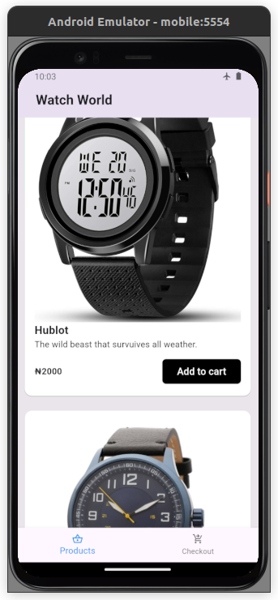
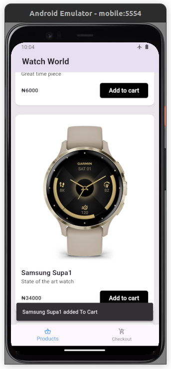
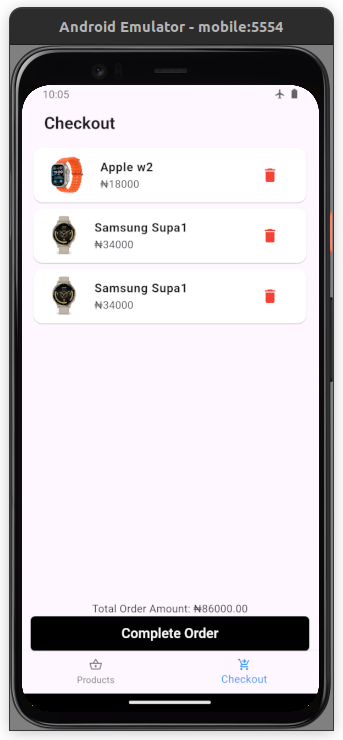
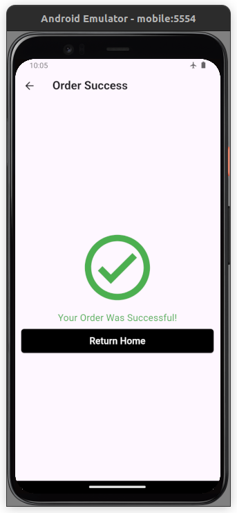

# shopa

A project Written in flutter, which is an e-commerce app, that shows a list of products and a checkout page.

In the product page you can add products to cart and the navigate to checkout and checkout all products or delete some and you will be navigated to a success order page

## Running The Code

This project was built on a linux(Ubuntu) powered system, to get the code running, make sure you have Flutter set up on your system, open a terminal and navigate to the root directory of the app by using the below command:

`cd shopa/`

Run the project by typing the below comand in the terminal:

`flutter run -d <preferred device>`

#### Some Images of the App
  

  

### Download the APK and view on Appetize

- [Download: Follow this link to download the App](https://drive.google.com/file/d/1H3tf6zQwrqr5px2kXDslmbVmP413wKxh/view?usp=sharing)

After downloading click the APK file and install.

- [Appetize: Follow this link to demo the app on Appetize](https://appetize.io/app/62u4nfotjmismifo2g5bkkdyi4?device=pixel8&osVersion=14.0&record=true)

